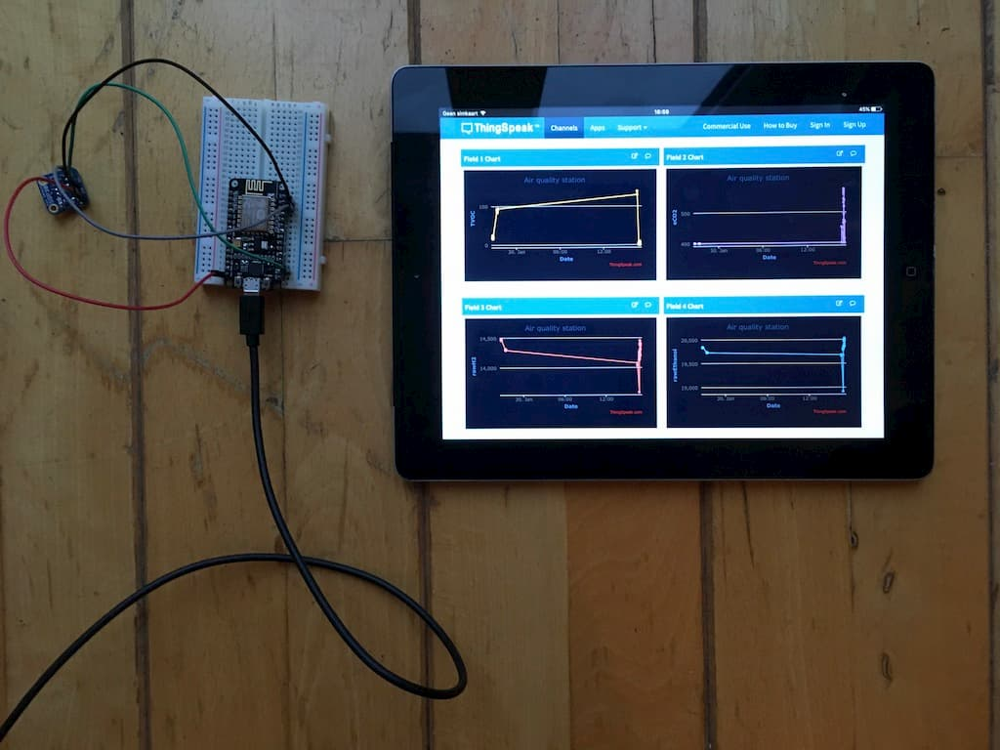
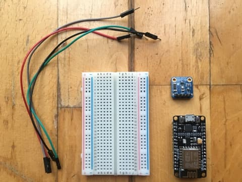
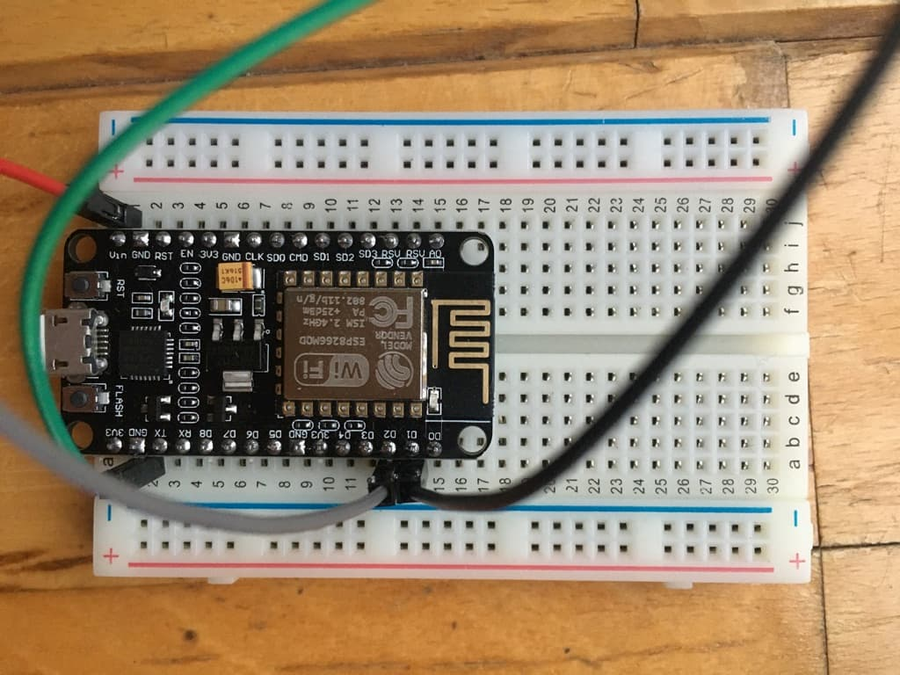
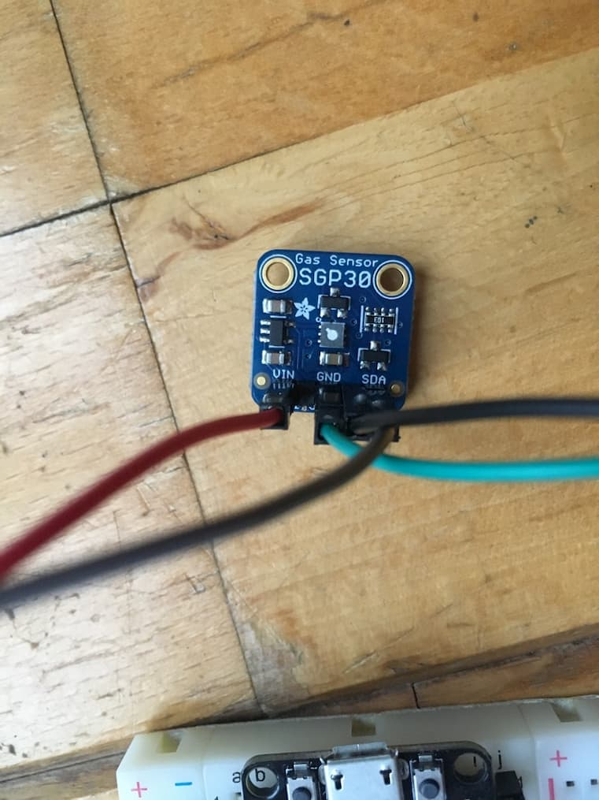

# IoT, Measure Air quality with an ESP-8266(NodeMCU v2) and SGP-30

This project measures indoor air quality with an SGP-30 sensor. The data will be sent to ThingSpeak(thingspeak.com) to create insights in the air quality of the measured building. The measurement of this sensor is divided into four separate values. [Check the current air quality in my house.](https://thingspeak.com/channels/966551 "Check ThingSpeak")

### Volatile Organic Compounds (VOCs)

Volatile organic compounds (VOCs) are emitted as gases from certain solids or liquids. VOCs include a variety of chemicals, some of which may have short- and long-term adverse health effects. Concentrations of many VOCs are consistently higher indoors (up to ten times higher) than outdoors. VOCs are emitted by a wide array of products numbering in the thousands.

Organic chemicals are widely used as ingredients in household products. Paints, varnishes and wax all contain organic solvents, as do many cleaning, disinfecting, cosmetic, degreasing and hobby products. Fuels are made up of organic chemicals. All of these products can release organic compounds while you are using them, and, to some degree, when they are stored.

_Retrieved from: https://www.epa.gov/indoor-air-quality-iaq/volatile-organic-compounds-impact-indoor-air-quality_

### eCO2 (equivalent calculated carbon-dioxide)

It is a metric measure used to compare the emissions from various greenhouse gases based on their global-warming potential (GWP), by converting amounts of other gases to the equivalent amount of carbon dioxide with the same global warming potential.

_Tetreived from: https://ec.europa.eu/eurostat/statistics-explained/index.php/Glossary:Carbon_dioxide_equivalent_

### EtOH(Ethanol), H2

The amount of hydrogen(h2) and Ethanol in the room.

## How to build this IoT project?

### Hardware

* SGP 30 sensor
* ESP 8266
* 4 Jumper wires
* Breadboard
* Micro-USB cable that allows sync (A lot of USB cables are made for charging only)

### Software
* ThingSpeak
* Arduino IDE

### Connect the SGP-30 to the ESP-8266

### Install Adafruit SGP-30 library
[Tutorial](https://cdn-learn.adafruit.com/downloads/pdf/adafruit-sgp30-gas-tvoc-eco2-mox-sensor.pdf "Tutorial")

### Connect the ESP-8266
[Tutorial](https://www.teachmemicro.com/intro-nodemcu-arduino/ "Tutorial")

### Create a ThingSpeak account
[Create account](https://thingspeak.com/users/sign_up "Create account")

### Download the demo from this repository
Fill in the right ThingSpeak channels and Wifi credentials in the secrets.h file.